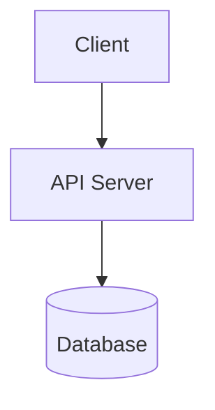

# Contributing to System Design Practice

Thank you for your interest in contributing! This guide will help you add your own system design examples.

## Ways to Contribute

1. **Add New System Design Diagrams**
   - Create new `.mmd` files for different architectures
   - Add them to the `diagrams/` directory

2. **Improve Existing Diagrams**
   - Enhance clarity and detail
   - Add missing components or flows

3. **Documentation**
   - Improve guides and explanations
   - Add more examples and use cases

4. **Code Examples**
   - Add implementation examples in the `examples/` directory

## Adding a New Diagram

### Step 1: Create the Mermaid Diagram

Create a new file in `diagrams/` with a `.mmd` extension:

```bash
touch diagrams/your-design.mmd
```

### Step 2: Write the Diagram

Use Mermaid syntax to create your diagram. See [docs/MERMAID_SYNTAX.md](docs/MERMAID_SYNTAX.md) for help.

Example:


### Step 3: Validate Your Diagram

Run the validation script:

```bash
npm run validate
```

### Step 4: Add to index.html (Optional)

To display your diagram on the main page, add a new section to `index.html`:

```html
<div id="your-design" class="diagram-container">
    <h2 class="diagram-title">Your Design Title</h2>
    <p class="diagram-description">
        Description of your design...
    </p>
    <div class="mermaid">
        <!-- Paste your Mermaid diagram code here -->
    </div>
</div>
```

Don't forget to add a navigation link:

```html
<nav>
    <ul>
        <!-- existing links -->
        <li><a href="#your-design">Your Design</a></li>
    </ul>
</nav>
```

### Step 5: Test Locally

```bash
npm run serve
```

Open `http://localhost:8080` in your browser to verify your diagram renders correctly.

### Step 6: Submit Your Changes

1. Fork the repository
2. Create a feature branch: `git checkout -b add-your-design`
3. Commit your changes: `git commit -am 'Add [Your Design] diagram'`
4. Push to the branch: `git push origin add-your-design`
5. Create a Pull Request

## Design Guidelines

### Naming Conventions

- Use kebab-case for file names: `url-shortener.mmd`, `chat-application.mmd`
- Use descriptive names that clearly identify the system

### Diagram Quality

- **Clarity**: Make sure components are clearly labeled
- **Completeness**: Include all major components and their interactions
- **Simplicity**: Don't overcomplicate; show the essential architecture
- **Consistency**: Use similar styling and conventions as existing diagrams

### Color Coding (Suggested)

- Client/User: Light blue (`#e1f5ff`)
- Load Balancers/Gateways: Light yellow (`#fff4e1`)
- Caches: Light red (`#ffe1e1`)
- Databases: Light green (`#e1ffe1`)
- Services/Workers: Light purple (`#f0e1ff`)

### Documentation

Each diagram should have:
- A clear title
- A brief description explaining the use case
- Notes about key design decisions or trade-offs

## What Makes a Good System Design Example?

1. **Real-World Relevance**: Choose systems people actually use
2. **Educational Value**: Demonstrate important concepts (scaling, caching, etc.)
3. **Clear Trade-offs**: Show why certain choices were made
4. **Scalability Considerations**: Address how the system handles growth
5. **Failure Modes**: Consider what happens when things go wrong

## Example Ideas

Here are some systems you could add:

- Video streaming platform (Netflix-like)
- E-commerce platform (Amazon-like)
- Search engine (Google-like)
- Ride-sharing service (Uber-like)
- Food delivery system (DoorDash-like)
- Gaming platform
- Content management system
- API rate limiter
- Distributed cache
- Task scheduler
- Notification system
- Recommendation engine
- File storage system
- Real-time analytics platform

## Code of Conduct

- Be respectful and constructive
- Focus on learning and teaching
- Help others understand system design concepts
- Provide helpful feedback in pull request reviews

## Questions?

If you have questions or need help, feel free to:
- Open an issue on GitHub
- Check existing documentation in the `docs/` folder
- Review the [Getting Started Guide](docs/GETTING_STARTED.md)

## License

By contributing, you agree that your contributions will be licensed under the MIT License.

---

Thank you for making system design more accessible to everyone! 🎉
