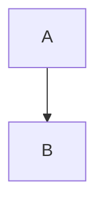
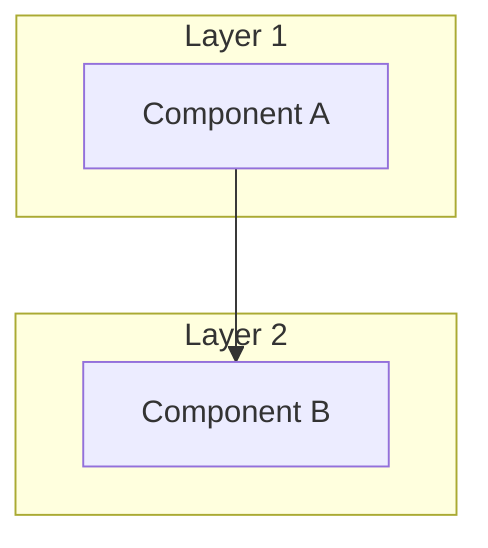
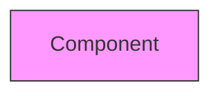
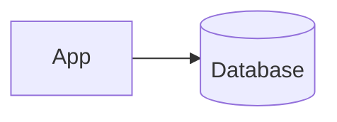
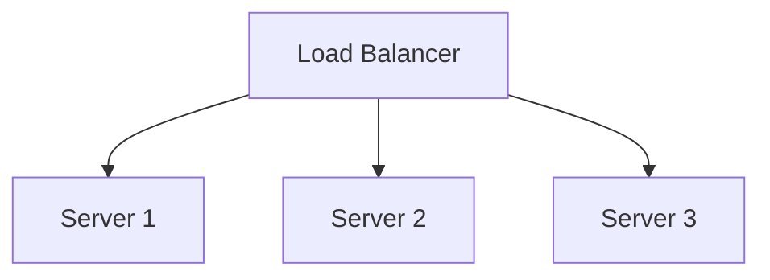

# Quick Reference Guide

## Viewing Diagrams

### Option 1: Direct HTML (Fastest)
```bash
# Just open index.html in your browser
open index.html  # macOS
xdg-open index.html  # Linux
start index.html  # Windows
```

### Option 2: Local Server
```bash
npm run serve
# Visit http://localhost:8080
```

### Option 3: Online Editor
1. Copy content from any `.mmd` file
2. Visit https://mermaid.live/
3. Paste and edit

## Common Commands

```bash
# Install dependencies
npm install

# Validate all diagrams
npm run validate
# or
npm test

# Start local server
npm run serve
```

## Creating a New Diagram

```bash
# 1. Create new file
touch diagrams/my-design.mmd

# 2. Add Mermaid code
cat > diagrams/my-design.mmd << 'EOF'
graph TB
    A[Start] --> B[Process]
    B --> C[End]
EOF

# 3. Validate
npm run validate
```

## File Structure

```
.
├── diagrams/           # Your .mmd files go here
├── docs/              # Documentation
├── examples/          # Templates and examples
└── index.html         # Main viewer
```

## Useful Mermaid Patterns

### Basic Graph


### With Subgroups


### With Styling


### Database


### Multiple Servers


## Connection Types

- `-->` Solid arrow
- `---` Solid line
- `-.->` Dotted arrow
- `==>` Thick arrow
- `-- text -->` Labeled arrow

## Resources

- 📚 [Full Documentation](docs/GETTING_STARTED.md)
- 🎨 [Mermaid Syntax](docs/MERMAID_SYNTAX.md)
- 📝 [Template](examples/TEMPLATE.md)
- 🤝 [Contributing](CONTRIBUTING.md)
- 🌐 [Mermaid Docs](https://mermaid.js.org/)
