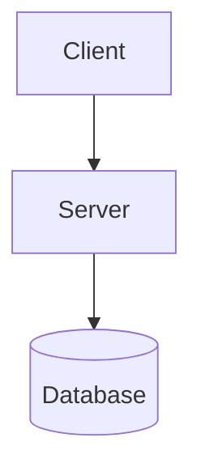

# System Design Practice

A comprehensive collection of system design patterns and architectures visualized using Mermaid.js.

## 🎯 Overview

This repository serves as a practical resource for learning and practicing system design concepts through interactive diagrams. Each design pattern is documented with clear visualizations using Mermaid.js, making complex architectures easy to understand.

## ✨ Features

- **Interactive Diagrams**: View system design diagrams directly in your browser
- **Multiple Examples**: URL shortener, chat application, social media feed, and more
- **Mermaid.js Integration**: Industry-standard diagramming tool
- **Easy to Extend**: Add your own system design examples
- **No Build Required**: Open `index.html` directly or use the built-in server

## 🚀 Quick Start

### View Diagrams Instantly

1. **Clone the repository**:
   ```bash
   git clone https://github.com/0xRichardL/system-design-practice.git
   cd system-design-practice
   ```

2. **Install dependencies**:
   ```bash
   npm install
   ```

3. **Open in browser**:
   - **Option A**: Simply open `index.html` in your browser
   - **Option B**: Run the local server:
     ```bash
     npm run serve
     ```
     Then visit `http://localhost:8080`

## 📚 Included System Designs

### 1. URL Shortener
- Horizontal scaling with load balancer
- Redis caching for high-read throughput
- Analytics tracking
- PostgreSQL for persistent storage

### 2. Chat Application
- Real-time messaging with WebSockets
- Message queue for reliability (Kafka/RabbitMQ)
- Push notifications for offline users
- MongoDB for message storage

### 3. Social Media Feed
- CDN for media delivery
- Multi-layer caching strategy
- Graph database for social connections (Neo4j)
- Feed generation service

## 📖 Documentation

- [Getting Started Guide](docs/GETTING_STARTED.md) - Installation and setup instructions
- [Mermaid Syntax Guide](docs/MERMAID_SYNTAX.md) - Learn how to create diagrams

## 🏗️ Project Structure

```
system-design-practice/
├── diagrams/              # Mermaid diagram source files (.mmd)
│   ├── url-shortener.mmd
│   ├── chat-application.mmd
│   └── social-media-feed.mmd
├── docs/                  # Documentation
│   ├── GETTING_STARTED.md
│   └── MERMAID_SYNTAX.md
├── examples/              # Future: Code implementations
├── index.html             # Interactive diagram viewer
├── package.json           # Dependencies and scripts
└── README.md             # This file
```

## 🛠️ Available Scripts

- `npm run serve` - Start local web server on port 8080
- `npm test` - Run tests (placeholder)

## 💡 Creating Your Own Diagrams

1. Create a new `.mmd` file in the `diagrams/` directory
2. Use Mermaid syntax to define your architecture
3. Add it to `index.html` or view it in [Mermaid Live Editor](https://mermaid.live/)

Example:


## 🌐 Resources

- [Mermaid.js Official Documentation](https://mermaid.js.org/)
- [Mermaid Live Editor](https://mermaid.live/) - Test diagrams online
- [System Design Primer](https://github.com/donnemartin/system-design-primer)
- [System Design Interview Guide](https://www.educative.io/courses/grokking-the-system-design-interview)

## 🤝 Contributing

Contributions are welcome! Feel free to:
- Add new system design patterns
- Improve existing diagrams
- Add code examples
- Enhance documentation

## 📝 License

MIT License - feel free to use this for learning and practice!

## 🎓 Learning Path

1. Start with the included examples to understand basic patterns
2. Read the [Mermaid Syntax Guide](docs/MERMAID_SYNTAX.md)
3. Create your own system design diagrams
4. Practice explaining the trade-offs and scalability considerations

---

**Happy Learning! 🚀**