# Copy Trading

**Status:** Draft

## Learning Focus

Event ingestion, subscription projection, sharded fan-out, ordering, duplicate handling, and execution against an external trading API.

## System Boundary

### In Scope

- Store follower-to-master subscriptions.
- Consume master events from Hyperliquid.
- Route master events to copy-engine shards.
- Submit copied actions through the Hyperliquid REST API.

### Out of Scope

- Not yet defined.

## Requirements

### Functional

- A follower can subscribe to a master.
- The system consumes master events and routes them to the responsible copy engine.
- The copy engine reads subscriptions and submits follower actions.

### Non-functional

- Not yet defined.

### Constraints

- The design uses Hyperliquid WebSocket and REST APIs as external dependencies.
- Other constraints are not yet defined.

## Scale Estimates

Not yet defined. Required inputs include master count, followers per master, event rate, burst factor, and external API limits.

## Core Invariants

Not yet defined. The design needs explicit rules for event ordering, duplicate events, and one copied effect per eligible follower.

## API and State Transitions

Only the conceptual `subscribe(master.1)` operation is shown. Request contracts and subscription states are not yet defined.

## Data Model

The diagram shows a source subscription database synchronized into sharded subscription data. Schema, ownership, and synchronization semantics are not yet defined.

## Architecture and Critical Flows

The current design separates subscription management, master-event ingestion, event distribution, sharded copy engines, and external execution.

## Consistency and Transactions

Not yet defined. Subscription propagation and the relationship between event acknowledgement and copied execution need explicit guarantees.

## Failure Handling

Not yet defined.

## Decisions and Trade-offs

| Decision | Requirement or invariant protected | Why | Trade-off |
| -------- | ---------------------------------- | --- | --------- |
| Shard copy engines by groups of masters | Not yet defined | Bounds the masters and subscriptions handled by one engine | Hot masters can create uneven load |
| Use an event exchange between ingestion and copying | Not yet defined | Decouples ingestion from follower execution | Introduces delivery, ordering, and retry semantics |

## Open Questions

- How are duplicate events from multiple listener paths detected and handled?
- How stale may the sharded subscription projection become?
- What ordering guarantee is required per master and follower?
- How are external rate limits and bursts controlled?
- What happens when only some follower executions succeed?
- How are copied actions sized, authorized, and made idempotent?

## References

- [Hyperliquid WebSocket API](https://hyperliquid.gitbook.io/hyperliquid-docs/for-developers/api/websocket)
- [Hyperliquid Exchange Endpoint](https://hyperliquid.gitbook.io/hyperliquid-docs/for-developers/api/exchange-endpoint)
- [Enterprise Integration Patterns: Message Channel](https://www.enterpriseintegrationpatterns.com/patterns/messaging/MessageChannel.html)
