# Money Transfer

**Status:** Draft

## Learning Focus

Ledger invariants, idempotency, transactional outbox, derived balances, CQRS, sharding, and distributed transfer coordination.

## System Boundary

### In Scope

- Initiate an internal money transfer.
- Process single-shard and multi-shard transfers.
- Record ledger and balance changes.
- Publish balance updates and serve balance reads.

### Out of Scope

- KYC, FX conversion, and external bank settlement.
- Other exclusions are not yet defined.

## Requirements

### Functional

- Initiate a transfer.
- Check a balance.
- Support reversal as a stated requirement; its flow is not yet modeled.

### Non-functional

- Consistency is prioritized over availability and latency for ledger-changing operations.
- Numeric targets are not yet defined.

### Constraints

- The design distinguishes single-shard from multi-shard transfers.
- Other constraints are not yet defined.

## Scale Estimates

Not yet defined. Required inputs include account count, normal and peak transfer rate, currency count, retention, and shard capacity.

## Core Invariants

- A balance must not become negative when overdrafts are forbidden.
- Every completed transfer must balance total debits and credits.
- A client idempotency key must not create more than one transfer effect.
- Retried event delivery must not create duplicate ledger effects.

## API and State Transitions

The diagram shows transfer initiation and balance lookup. API contracts and the complete transfer state machine are not yet defined.

## Data Model

The ledger is the durable history, balances are derived state, and outbox messages represent events awaiting publication. Whether every relationship is a physical database foreign key or a logical cross-shard reference is not yet defined.

## Architecture and Critical Flows

Single-shard processing updates ledger, balance, and outbox records atomically. Multi-shard processing uses a coordinator and separate debit and credit shards. Reads use a balance projection.

## Consistency and Transactions

- Single-shard ledger, balance, and outbox changes share one atomic boundary.
- The multi-shard flow coordinates separate local commits.
- The read-side balance database is eventually updated.
- Isolation levels and stale-read behavior are not yet defined.

## Failure Handling

Idempotency, an outbox, and a compensation message appear in the design. Retry policies, timeouts, recovery, dead-letter handling, and reconciliation are not yet defined.

## Decisions and Trade-offs

| Decision | Requirement or invariant protected | Why | Trade-off |
| -------- | ---------------------------------- | --- | --------- |
| Append ledger entries | Preserve audit history and balanced transfer effects | History supports audit and reconstruction | Requires projections for efficient current-state reads |
| Transactional outbox for local writes | Avoid losing an event after a committed state change | State and event intent share one transaction | Publication is asynchronous and needs a relay |
| Separate balance read model | Scale and isolate reads | Read traffic does not contend directly with ledger processing | Balance views can lag |

## Open Questions

- How is transaction creation made atomic with publishing the command to the exchange?
- A failed credit normally requires compensating the committed debit; should `credit.compensate` target the debit shard?
- What event or timeout represents a rejected credit?
- What are the coordinator's durable states and recovery rules?
- How are outbox relaying, consumer deduplication, and reconciliation implemented?
- What freshness guarantee does the balance API expose?

## References

- [PostgreSQL: Transaction Isolation](https://www.postgresql.org/docs/current/transaction-iso.html)
- [AWS Prescriptive Guidance: Transactional Outbox Pattern](https://docs.aws.amazon.com/prescriptive-guidance/latest/cloud-design-patterns/transactional-outbox.html)
- [AWS Prescriptive Guidance: Saga Pattern](https://docs.aws.amazon.com/prescriptive-guidance/latest/cloud-design-patterns/saga.html)
- [Microservices.io: Transactional Outbox](https://microservices.io/patterns/data/transactional-outbox.html)
