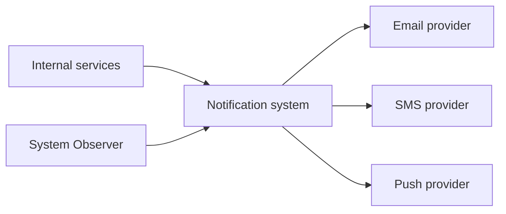
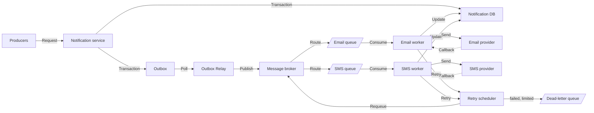
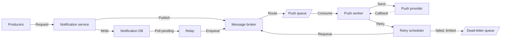
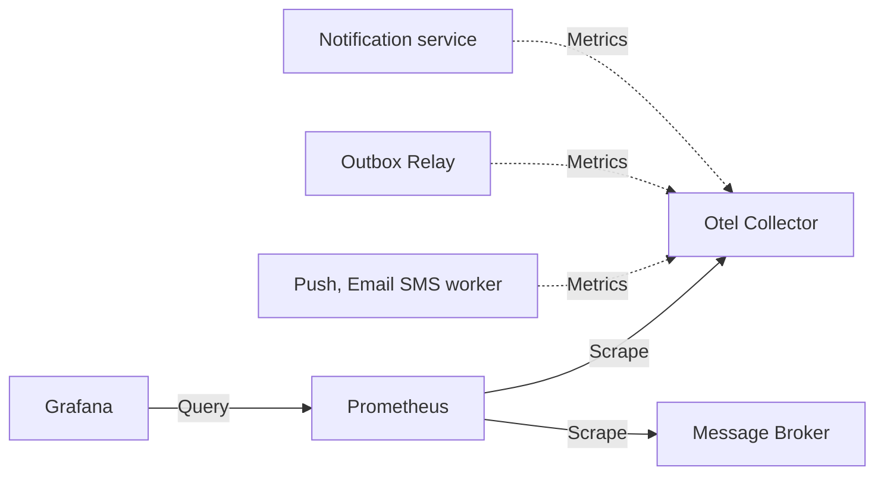

# Notification Service

**Status:** Draft

## Learning Focus

Design a notification service supporting email, push, and SMS.

## System Boundary

### In Scope

- User: Receives app notifications through email, push, or SMS.
- Core operation:
  - Notification service receives a notification event from internal topic and routes the message to the correct channel & user.
  - Push notification: Fast delivery to the user device, eventually consistent.
  - Email: Delivered to the user mailbox, high consistent.
  - SMS: Delivered to the user device, high consistent.
  - Orchestrate message delivery through the Email, SMS, and app push channels.
- Single region, no global distribution.
- Asynchronous processing, no synchronous API.

### Out of Scope

- Transactional notifications.
- scheduling notifications.
- Bulk notifications.
- User preferences for notification channels.
- Email templating.

## Requirements

### Functional

- Internal service creates a notification event with target channel and target users.
- Notification service routes the message to the correct channel & user.
- Validate the inputs based on the channel.
- For Email, fill in the template data through external.

### Non-functional

| Requirement | Email | SMS | Push |
| ----------- | ----- | --- | ---- |
| P95 | < 35s | < 35s | < 2s |
| P99 | < 70s | < 70s | < 5s |
| Reliability & Delivery Guarantees | at-least-one | at-least-one | at-least-one |
| Availability | 99.9% | 99.9% | 99.9% |
| Rate-limiting & throttling | 10/min | 5/min | 20/min |
| Retention | 3 months | 3 months | 30 days |

### Constraints

- The system is deployed in one single region.
- Only internal services can reach the notification service.
- Producers are internal services and can call to Notification service synchronously through internal API.
- Provider delivery is asynchronous by the Notification system.
- One request exactly target one user and one channel.
- Producers may retry after timeout, the system has a method to ensure the idempotency.
- Email, SMS, Push are delivery through external providers.
- Provider has independent quota, latency, availability, and retry behavior.

## Scale Estimates

### User scale

| Requirement | Value |
| --- | ---: |
| Registered users | 50 million |
| Daily active users | 10 million |
| Average notifications per active user per day | 5 |
| Expected growth | 2× within two years |

Each notification targets exactly:

- One user.
- One channel: email, SMS, or push.
- One destination.
- No bulk notifications or multi-channel fan-out.

### Channel distribution

| Channel | Percentage |
| --- | ---: |
| Push | 70% |
| Email | 20% |
| SMS | 10% |

Assume the distribution remains approximately the same during peak periods.

### Traffic pattern

- Traffic occurs continuously throughout the day.
- Peak traffic is 10× average traffic.
- The system must provision 2× headroom above the calculated peak.
- A producer may retry an event, so approximately 2% of incoming events are duplicates.
- Approximately 5% of provider requests require at least one retry.

### External provider behavior

| Channel | Average API latency | Account quota |
| --- | ---: | ---: |
| Push | 100 ms | 10,000 requests/s |
| Email | 300 ms | 2,500 requests/s |
| SMS | 500 ms | 1,000 requests/s |

### Usable concurrency per instance

Given a instance can handle 50 concurrent requests.

Usable concurrency per instance:

$$
U = 50 * 60\% = 30
$$

### Service scale

| Requirement | Total | Push | Email | SMS |
| --- | ---: | ---: | ---: | ---: |
| Notification per day - QPD | 50M/day | 35M/day | 10M/day | 5M/day |
| Average notifications per second - QPS | 579/s | 405/s | 116/s | 58/s |
| Concurrent requests | 104 | 41 | 35 | 29 |
| Peak notifications per second - Peak QPS | 5,790/s | 4,050/s | 1,160/s | 580/s |
| Concurrent requests at peak | 1,040 | 400 | 350 | 290 |
| Required capacity with headroom | 11,580/s | 8,100/s | 2,320/s | 1,160/s |
| CCR with headroom | 2,086 | 810 | 696 | 580 |
| Approximate instances under-load | 5 | 2 | 2 | 1 |
| Approximate instances peak | 36 | 14 | 12 | 10 |
| Approximate instances peak with headroom | 71 | 27 | 24 | 20 |

### Event size

| Item | Average | Maximum |
| --- | ---: | ---: |
| Incoming notification event | 1 KB | 4 KB |
| Broker message | 1 KB | 4 KB |
| Notification database record | 1.5 KB | 5 KB |
| Outbox record | 500 bytes | 2 KB |
| Provider callback | 500 bytes | 2 KB |

### Broker bandwidth

| Type | Bandwidth |
| --- | ---: |
| Average | 579/s * 1KB = 579KB |
| Peak | 5,790/s * 1KB = 5.79MB |
| Capacity with headroom | 5.79MB * 2 = 11.58MB |

### Retention

| Data | Retention |
| --- | ---: |
| Push notifications | 30 days |
| Email notifications | 90 days |
| SMS notifications | 90 days |
| Published outbox records | 24 hours |
| Dead-letter messages | 14 days |
| Operational logs | 30 days |

### Database scale

#### Database writes per operation

| Operation | Push | Email | SMS |
| --- | ---: | ---: | ---: |
| Notification insert | 1 | 1 | 1 |
| Outbox insert | 0 | 1 | 1 |
| Outbox published update | 0 | 1 | 1 |
| Provider-response status update | 1 | 1 | 1 |
| Provider callback update | 0 | 1 | 1 |
| **Base writes per notification** | **2** | **5** | **5** |

#### Database writes

| Type | Push | Email | SMS | Total |
| ---- | ---: | ----: | --: | ---: |
| Base writes = QPS * writes | 405*2 = 810 writes/s | 116*5 = 580 writes/s | 58*5 = 290 writes/s | 1680 writes/s |
| Peak base writes = Peak QPS * writes | 4,050*2 = 8,100 writes/s | 1,160*5 = 5,800 writes/s | 580*5 = 2,900 writes/s | 16,800 writes/s |
| Additional retry writes = Peak QPS * retry percents | | | | 5,790*5% = 290 writes/s |
| Total peak writes | | | | 17,100 writes/s |
| Capacity headroom | | | | 17,100*2 = 34,200 writes/s |

#### Retain notification records

| Channel | Daily volume | Retention | Retained records | Storage |
| --- | ---: | ---: | ---: | ---: |
| Push | 35M | 30 days | 1.05B | x 1.5 KB = 1.575 TB |
| Email | 10M | 90 days | 900M | × 1.5 KB = 1.35 TB |
| SMS | 5M | 90 days | 450M | × 1.5 KB = 0.675 TB |
| Total | 50M | | 2.4B | 3.6 TB |

With 30% index overhead: 3.6TB * 1.3 = 4.68TB

### Retain outbox records

Outbox records = Email records + SMS records = 10M + 5M = 15M

Outbox storage =  15M * 0.5KB = 7.5GB

With index overhead = 7.5GB * 1.3 = 9.75GB

## Core Invariants

- One event target to exact one user.
- One event target to exact one channel.
- The worker must not change the notification data, user or channel.
- Invalid event must never reach the provider.
- The notification service returns `202 Accepted` only after notification and dispatch intent are durably stored.
- A producer and an idempotency key identify at most one logical notification.
- The notification is marked as `ProviderAccepted` when the provider accepts the request, it must never be interpreted as confirmed end-user delivery.
- A notification must not be retried after its expiry time or after a permanent failure.

## API and State Transitions

### Producer publication

The broker accepts the event when it durably stores the event and returns confirmation to the producer.
This only means the Notification service has accepted the event, not processed it.

### Notification service acceptance

The Notification service accepts a notification when:

1. The request passes validation.
2. The Notification and Outbox records commit in one database transaction.
3. The service returns `202 Accepted` to the producer.

### Email/Push Worker service acceptance

The Worker service processes an event when:

1. The event is routed to the correct queue which is bind to the worker.
2. The event `Channel` matched the worker.
3. The event `RetryCount` must not exceed the service retry setting.
4. The notification status is not `ProviderAccepted`, `Sent`, or `Failed`.
5. The `NextRetryAt` is passed the current.

## Data Model

```Golang
type Notification struct {
    ID          string // Primary Key, system generated
    IdemKey     string
    Producer    string
    Channel     string // Email, SMS, Push
    UserID      string
    TemplateID  string
    Data        map[string]string
    Status      string // Pending, Processing, ProviderAccepted, Sent, Failed
    Encrypted   bool // default false, true for sensitive data, DB only stores encrypted.
    RetryCount  int
    LastError   string
    NextRetryAt time.Time
    CreatedAt   time.Time
    UpdatedAt   time.Time
}

type Outbox struct {
    ID             string // Primary Key, system generated
    NotificationID string // Foreign Key to Notification
    Status         string // Pending, Sent, Failed
}
```

## Architecture and Critical Flows

### 1. System context



### 2. SMS, Email flows

#### 2.1 High level



### 3. Push flow

#### 3.1 High level



### 4. Metric observation flow

#### 4.1 High level



#### 4.1 Notification delivery duration

Metric details:

- Start: notification accepted
- End: provider accepted or permanently failed
- Processing time: Current time - `notification.createdAt`
- Producer: `notification.Producer`
- Channel: `notification.Channel`
- Outcome: Enum `accepted`, `failed`, `expired`
  - `expired`: When Status is failed with exceeding retry limit.

Output observations:

- SLO: p95, p99
- Success rate

## Consistency and Transactions

- IdemKey: Idempotent key, generated by the producer.
- Idempotency constraint: `UNIQUE(IdemKey + Producer)`
- Notification table unique constraint: IdemKey + Producer + Channel + UserID.

## Failure Handling

- Retry policy:

    | Channel | Type | Config |
    | -------- | ---- | ------ |
    | Email, SMS | Exponential backoff | base 2s; jitter 200ms; max 6 |
    | Push | Linear backoff | 1s; max 5 |

- Provider failure: Pushed to retry queue for later processing. If limits are reached, the notification is marked as failed and logged for manual intervention.

## Decisions and Trade-offs

| Decision | Requirement or invariant protected | Why | Trade-off |
| -------- | ---------------------------------- | --- | --------- |
| Notification Table + Outbox table wiring is in the same transaction | Data consistency | Ensure that notifications are only sent after being successfully stored | Increased complexity in managing and debugging transactions |
| Notification record write failure is handling by provider | Data consistency | Provider controls data consistency | Availability decreasing due to bottleneck |

## Open Questions

- Not yet defined.

## References

- Add authoritative standards, papers, or official product documentation.
