# Order Booking

**Status:** Draft

## Learning Focus

Broadcast delivery, provider matching, competitive claims, atomic winner selection, and user/provider notifications.

## System Boundary

### In Scope

- Persist a user's order.
- Select providers and broadcast an order notification.
- Accept provider claim attempts.
- Resolve a winning claim and notify participants.

### Out of Scope

- Not yet defined.

## Requirements

### Functional

- A user can place an order.
- Eligible providers receive a broadcast.
- Providers can attempt to claim an order.
- The system resolves the order and sends notifications.

### Non-functional

- Not yet defined.

### Constraints

- Broadcast processing is shown as location-sharded.
- AWS SNS is shown as the provider notification channel.
- Other constraints are not yet defined.

## Scale Estimates

Not yet defined. Required inputs include orders per second, providers per location, fan-out size, simultaneous claim rate, and notification latency.

## Core Invariants

Not yet defined. The design needs an explicit rule that at most one provider wins an order.

## API and State Transitions

The diagram shows place-order and claim-order actions. API contracts and valid order states are not yet defined.

## Data Model

Orders and providers are shown, but their schemas, ownership, indexes, and claim constraints are not yet defined.

## Architecture and Critical Flows

The design has two flows: location-aware broadcast and competitive claim resolution.

## Consistency and Transactions

Not yet defined. Claim resolution requires a stated serialization mechanism and transaction boundary.

## Failure Handling

Not yet defined. Duplicate notifications, retries, provider disconnects, and notification failures need policies.

## Decisions and Trade-offs

| Decision | Requirement or invariant protected | Why | Trade-off |
| -------- | ---------------------------------- | --- | --------- |
| Broadcast through AWS SNS | Reach multiple candidate providers | Managed fan-out separates matching from delivery | Delivery is asynchronous and may be duplicated |
| Location-shard broadcast processing | Not yet defined | Keeps matching close to a geographic provider set | Cross-location orders and hot locations need handling |

## Open Questions

- What atomic compare-and-set or uniqueness rule guarantees one winning provider?
- How are order persistence and `order.created` publication made atomic?
- Do the undirected queue edges represent publishing, consuming, or both?
- How are duplicate and late claims handled after resolution?
- What happens when database resolution succeeds but notification fails?
- How are provider eligibility and geographic boundaries defined?

## References

- [Amazon SNS Developer Guide](https://docs.aws.amazon.com/sns/latest/dg/welcome.html)
- [PostgreSQL: Explicit Locking](https://www.postgresql.org/docs/current/explicit-locking.html)
- [AWS Prescriptive Guidance: Transactional Outbox Pattern](https://docs.aws.amazon.com/prescriptive-guidance/latest/cloud-design-patterns/transactional-outbox.html)
