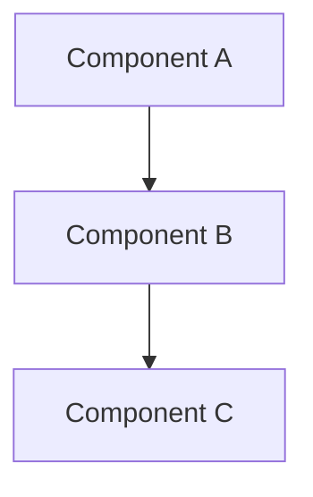

# Getting Started with System Design Practice

## Overview

This repository provides a collection of system design patterns and examples using Mermaid.js for visualization. It's designed to help you learn and practice common system design architectures.

## Prerequisites

- Node.js (v14 or higher)
- npm or yarn
- A modern web browser

## Installation

1. Clone the repository:
```bash
git clone https://github.com/0xRichardL/system-design-practice.git
cd system-design-practice
```

2. Install dependencies:
```bash
npm install
```

## Viewing Diagrams

### Method 1: Local Web Server

1. Start the local server:
```bash
npm run serve
```

2. Open your browser and navigate to:
```
http://localhost:8080
```

### Method 2: Direct HTML File

Simply open `index.html` in your web browser.

### Method 3: Online Mermaid Editor

1. Copy the content from any `.mmd` file in the `diagrams/` directory
2. Visit [Mermaid Live Editor](https://mermaid.live/)
3. Paste the content to view and edit

## Creating Your Own Diagrams

### Using Mermaid Syntax

Create a new `.mmd` file in the `diagrams/` directory:



### Diagram Types Supported

Mermaid supports various diagram types:

- **Flowcharts/Graphs**: System architecture diagrams
- **Sequence Diagrams**: API flow and interaction
- **Class Diagrams**: Data models
- **State Diagrams**: System states
- **Entity Relationship Diagrams**: Database schemas
- **Gantt Charts**: Project timelines

## Example Diagrams Included

1. **URL Shortener** (`diagrams/url-shortener.mmd`)
   - Load balancing
   - Caching strategy
   - Database design
   - Analytics tracking

2. **Chat Application** (`diagrams/chat-application.mmd`)
   - WebSocket connections
   - Message queue
   - Push notifications
   - Real-time messaging

3. **Social Media Feed** (`diagrams/social-media-feed.mmd`)
   - CDN integration
   - Feed generation
   - Graph database for social connections
   - Multi-layer caching

## Project Structure

```
system-design-practice/
├── diagrams/           # Mermaid diagram source files (.mmd)
├── docs/              # Documentation
├── examples/          # Example implementations
├── index.html         # Interactive diagram viewer
├── package.json       # Project dependencies
└── README.md          # Project overview
```

## Resources

- [Mermaid.js Documentation](https://mermaid.js.org/)
- [System Design Primer](https://github.com/donnemartin/system-design-primer)
- [Mermaid Live Editor](https://mermaid.live/)

## Contributing

Feel free to add your own system design diagrams and examples!

## License

MIT
