# Mermaid.js Syntax Guide for System Design

## Basic Graph Syntax

### Graph Direction

```mermaid
graph TB  # Top to Bottom
graph LR  # Left to Right
graph BT  # Bottom to Top
graph RL  # Right to Left
```

### Node Shapes

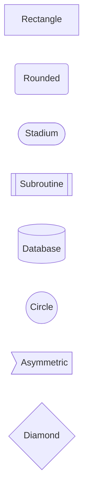

### Connections

```mermaid
graph LR
    A --> B        # Arrow
    A --- B        # Line
    A -.-> B       # Dotted arrow
    A ==> B        # Thick arrow
    A -- text --> B  # Arrow with label
```

## System Design Patterns

### Load Balancer Pattern

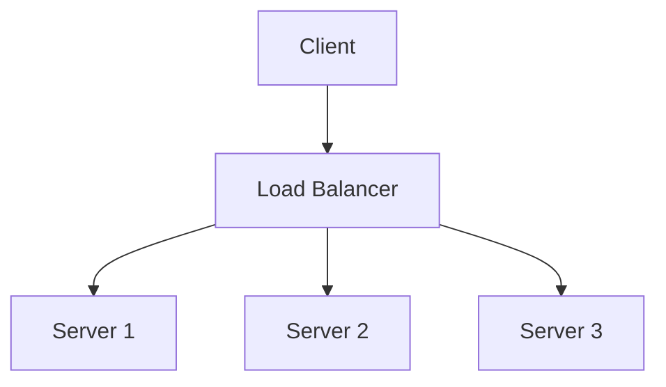

### Caching Pattern

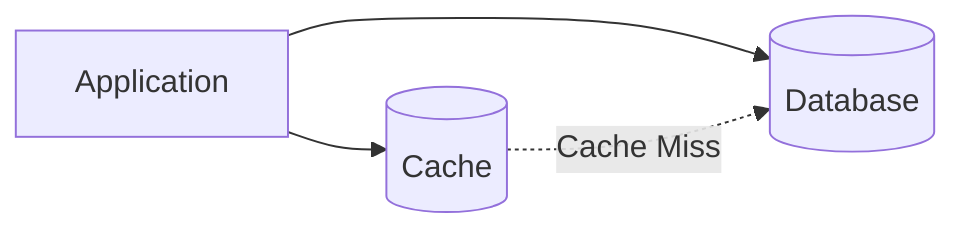

### Microservices Pattern

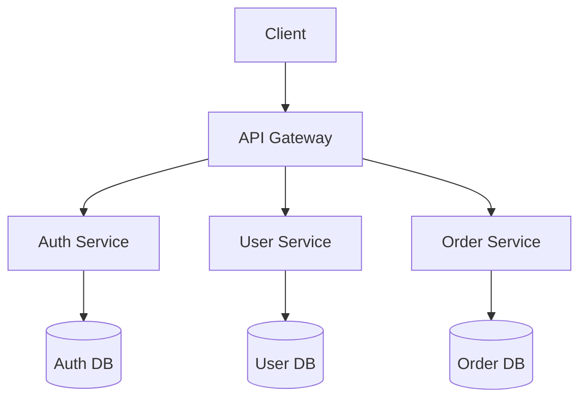

## Styling

### Node Styling

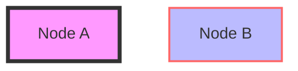

### Subgraphs

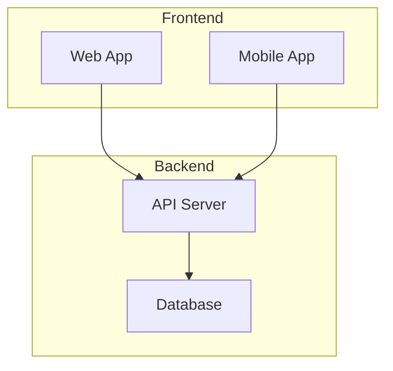

## Sequence Diagrams

Use sequence diagrams for API flows:

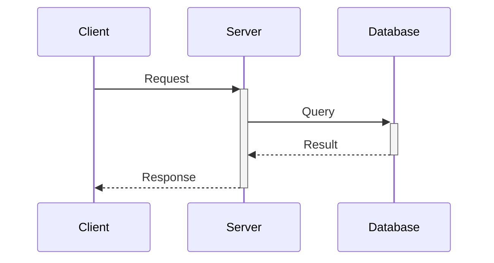

## Best Practices

1. **Keep it Simple**: Don't overcrowd diagrams
2. **Use Subgraphs**: Group related components
3. **Consistent Naming**: Use clear, descriptive names
4. **Add Legends**: Explain symbols if needed
5. **Use Colors**: Differentiate layers/types of components
6. **Label Connections**: Show data flow direction and type

## Common System Design Components

### Database Symbol
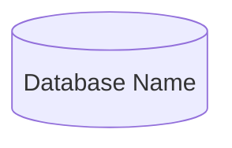

### Cache Symbol
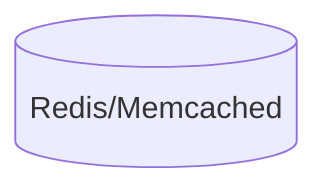

### Queue Symbol
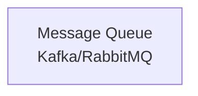

### Load Balancer
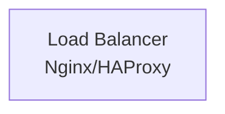

## Examples

### Three-Tier Architecture

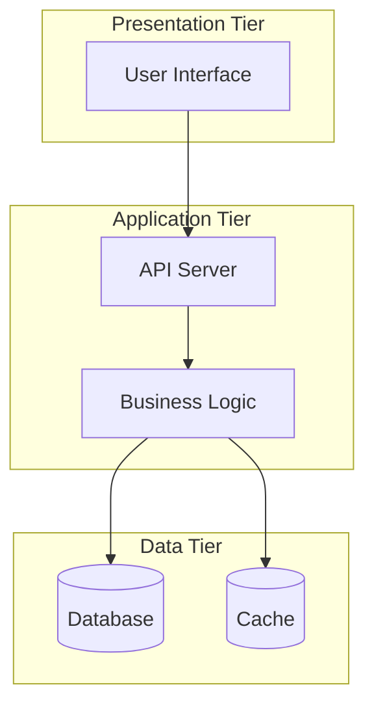

### Event-Driven Architecture

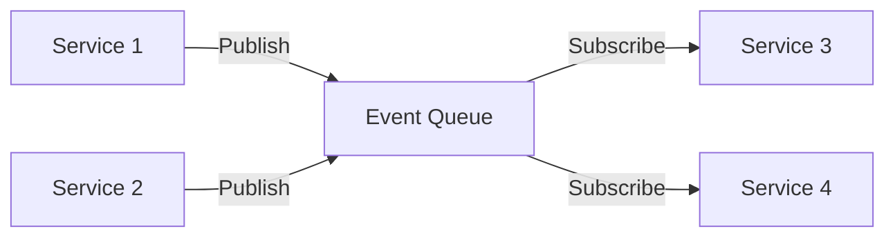

## Reference

For complete syntax reference, visit: [Mermaid Documentation](https://mermaid.js.org/intro/)
