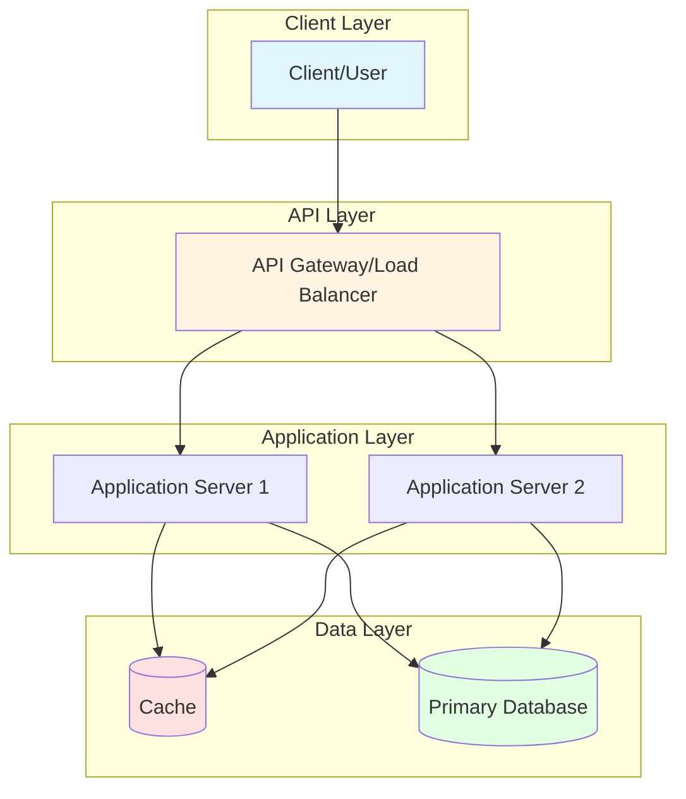
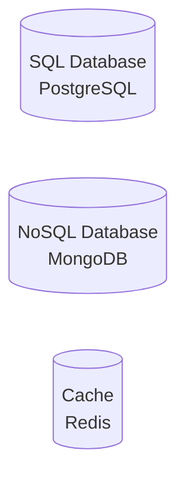
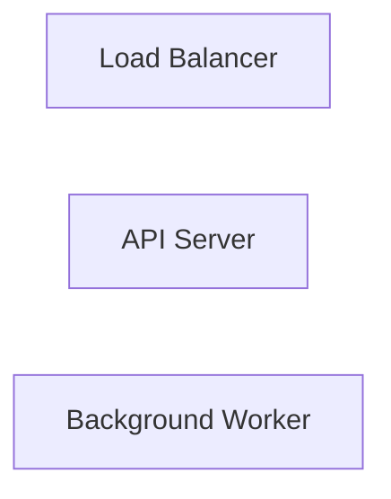
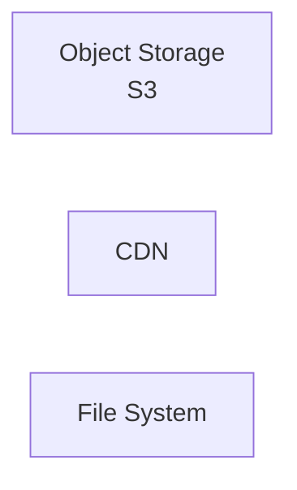
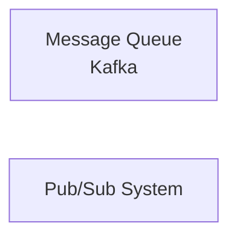

# System Design Template

Use this template to create your own system design diagrams.

## Template Structure

## Steps to Create Your Design

1. **Identify Components**
   - What are the main system components?
   - What layers does your system have?

2. **Define Relationships**
   - How do components communicate?
   - What protocols are used?

3. **Add Details**
   - Technology choices (Redis, PostgreSQL, etc.)
   - Data flow direction
   - Replication/scaling strategies

4. **Style and Organize**
   - Use subgraphs to group related components
   - Apply consistent colors for component types
   - Add descriptive labels

## Common Components

### Databases

### Servers

### Storage

### Messaging

## Design Checklist

- [ ] Scalability: Can the system handle increased load?
- [ ] Reliability: What happens when components fail?
- [ ] Performance: Are there caching and optimization strategies?
- [ ] Security: How is data protected?
- [ ] Monitoring: How do you track system health?
- [ ] Data Consistency: How is consistency maintained?
- [ ] Cost: Is the design cost-effective?

## Example Use Cases to Practice

1. **E-commerce Platform**
   - Product catalog
   - Shopping cart
   - Order processing
   - Payment integration
   - Inventory management

2. **Video Streaming Service**
   - Video upload and encoding
   - Content delivery
   - User recommendations
   - Analytics and reporting

3. **Ride Sharing Service**
   - Real-time location tracking
   - Ride matching algorithm
   - Payment processing
   - Driver/rider ratings

4. **Content Management System**
   - Article creation and editing
   - Publishing workflow
   - Search functionality
   - User permissions

5. **Online Gaming Platform**
   - Matchmaking
   - Real-time game state
   - Leaderboards
   - In-game purchases

## Tips

- Start simple, add complexity gradually
- Document assumptions and constraints
- Consider trade-offs explicitly
- Think about failure scenarios
- Plan for monitoring and observability
