# Scale and Reliability

**Status:** Draft

## Learning Focus

A calculation and terminology checklist for turning product requirements into capacity, latency, availability, recovery, durability, and consistency requirements.

## Overview

The map covers:

- scope, business invariants, and functional and non-functional requirements;
- user, request, and event throughput;
- concurrency and Little's Law;
- logical and physical storage growth;
- latency percentiles and tail-latency causes;
- availability, RPO, RTO, durability, and consistency.

## Working Rules

- State every input and unit before calculating capacity.
- Calculate normal load, peak load, failure-mode capacity, and growth headroom separately.
- Report latency as a distribution rather than only an average.
- Pair an availability percentage with its measurement window.
- State RPO and RTO independently.
- Name the failure scope used by a durability claim.
- Select consistency guarantees per operation, not once for the whole system.

## Formulas

| Quantity | Starting formula | Important qualification |
| -------- | ---------------- | ----------------------- |
| Request throughput | Active users × request rate | Separate average and peak behavior |
| Event throughput | Producers × event rate | Include fan-out and retries where applicable |
| Concurrency | Throughput × average time in system | Little's Law assumes a stable long-term system |
| Logical storage | Records × bytes per record × retention | Add indexes, metadata, replication, logs, and backups separately |

## Open Questions

- Which worked examples should accompany each formula?
- Should availability tables use a 30-day month, calendar month, or explicit seconds per window?
- Which database-specific storage overhead examples should be included?
- How should cost and network bandwidth be incorporated into the overview?

## References

- [Little's Law as Viewed on Its 50th Anniversary](https://doi.org/10.1287/opre.1110.0941)
- [Google SRE Book: Service Level Objectives](https://sre.google/sre-book/service-level-objectives/)
- [Google SRE Workbook: Implementing SLOs](https://sre.google/workbook/implementing-slos/)
- [AWS Well-Architected Framework: Reliability Pillar](https://docs.aws.amazon.com/wellarchitected/latest/reliability-pillar/welcome.html)
