# Service Communication

**Status:** Draft

## Problem

Route many client-service requests to a changing set of server-service instances while balancing availability, operational control, and connection efficiency.

## Context and Forces

- Service instances may be added, removed, or become unhealthy.
- HTTP/2 can multiplex many streams over a connection.
- Routing logic can live in a central proxy or in each client.
- Discovery data can become stale during failures or deployments.

## Mechanisms

### Central Load Balancer

Clients maintain HTTP/2 connections to a central Envoy- or HAProxy-like load balancer. The load balancer routes streams to server instances.

### Client-side Service Discovery

Clients query a registry such as Consul, etcd, or DNS and connect directly to discovered server instances.

## Guarantees

Neither diagram establishes a guarantee by itself. Health checking, discovery freshness, retry behavior, load-balancing policy, and connection draining determine observable behavior.

## Failure Modes

- A central load-balancer tier can become a bottleneck or shared failure boundary if it is not replicated.
- A client can route to an unhealthy instance when discovery data is stale.
- Long-lived HTTP/2 connections can preserve an uneven distribution after the server pool changes.
- Retries can amplify load and duplicate non-idempotent effects.

## When to Use

- Use a central load balancer when consistent policy, observability, and simpler clients are the priority.
- Use client-side discovery when direct connections and avoiding an extra proxy hop justify more client complexity.

## When to Avoid

- Avoid a single central proxy instance when it creates an unprotected failure point.
- Avoid client-side discovery when clients cannot consistently implement discovery, health, balancing, and retry policies.

## Trade-offs

| Approach | Benefit | Cost |
| -------- | ------- | ---- |
| Central load balancer | Central policy and simpler clients | Extra hop and a shared infrastructure tier |
| Client-side discovery | Direct connections and distributed routing | More complex clients and stale-discovery handling |

## Open Questions

- How are load balancers replicated and discovered?
- What health checks remove an instance, and how quickly?
- How do clients refresh discovery data and react to watch failures?
- What retry budget prevents failure amplification?
- How are HTTP/2 connections drained and rebalanced during deployments?

## References

- [RFC 9113: HTTP/2](https://www.rfc-editor.org/rfc/rfc9113)
- [HashiCorp Consul: Service Discovery](https://developer.hashicorp.com/consul/docs/concepts/service-discovery)
- [Envoy Architecture Overview](https://www.envoyproxy.io/docs/envoy/latest/intro/arch_overview/arch_overview)
- [AWS Elastic Load Balancing User Guide](https://docs.aws.amazon.com/elasticloadbalancing/latest/userguide/what-is-load-balancing.html)
